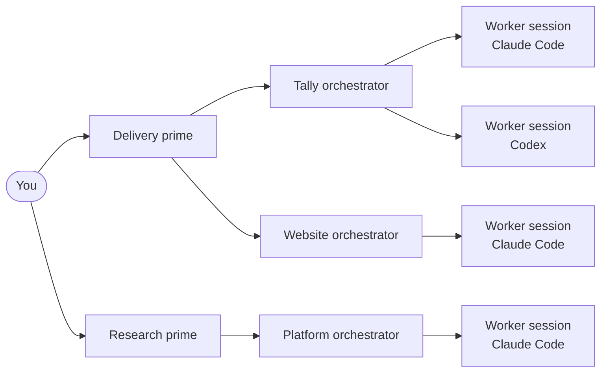
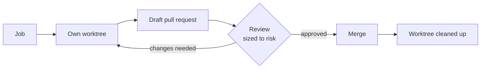
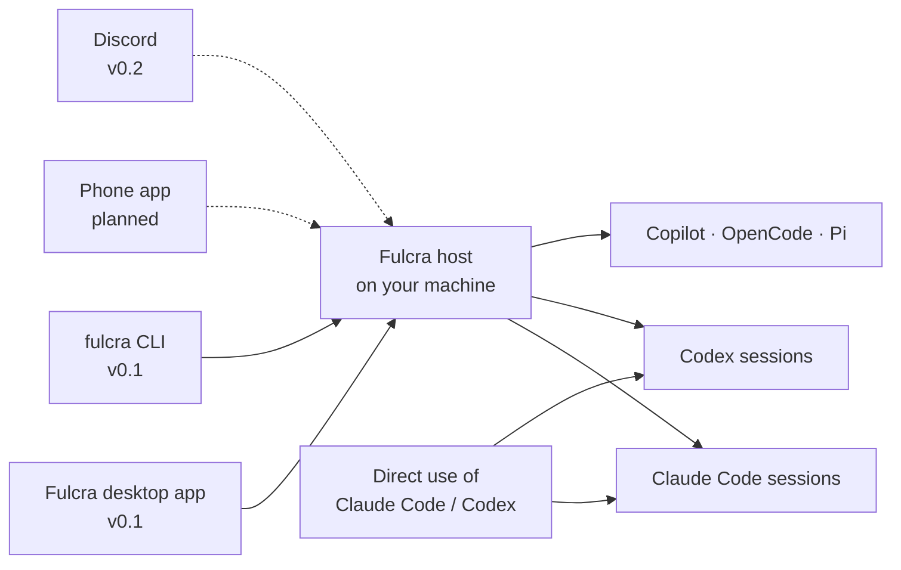
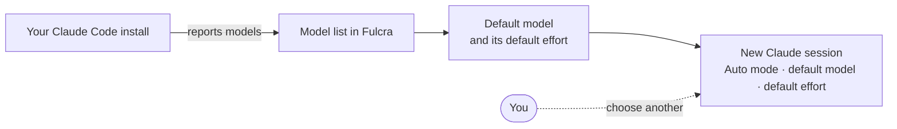

# Fulcra

**Run a team of real AI coding sessions from one place, and steer them without reading every line.**
Fulcra runs Claude Code, Codex and other agent CLIs as long-lived sessions on your own machine, and gives you one app
to start them, follow them, answer them and review what they changed. Your code stays on your machine.


<sub>Screens in this README use made-up demo data (a sample product called "Tally" and an example shop).</sub>

## Why Fulcra

- **Many sessions, one place.** Real Claude Code and Codex sessions — each with its own history, worktree and
  tools — side by side, instead of a stack of terminal tabs.
- **Steer, don't babysit.** See what each session is doing, what it changed and what it needs from you, then answer
  in one tap. You review outcomes, not keystrokes.
- **Sensible defaults.** New Claude sessions start in Auto mode on your account's default model and effort, so you
  are not re-choosing settings every time.
- **Yours to run.** Open source (Apache-2.0), runs on your machine, talks to the agent CLIs you already use.

## Availability at a glance

| Area | In v0.1 (released) | Coming in v0.2 (Command Centre) |
| --- | --- | --- |
| Sessions | Run Claude Code, Codex, Copilot, OpenCode and Pi sessions; follow, answer and steer them | Step-through replay of a session |
| Workspaces | Git worktrees per workspace, diffs, terminals, files | Job → draft PR → review → merge → clean-up, run for you |
| Models | Models read from your Claude Code install; Auto mode, default model and effort stored per session | — |
| GitHub | Pull request status through your `gh` login | Issues and pull requests in a Trackers view |
| Organisation, Inbox, Environments, Changes | — | All four (screens below) |
| Channels | Desktop app (macOS), `fulcra` CLI | Phone, Discord |

## How it works

### Who does what

You set direction. **Primes** lead areas of work, each project gets an **orchestrator**, and orchestrators hand work
to **worker sessions**. Workers are full, persistent Claude Code or Codex sessions — not throwaway subagents — so they
keep their history and can be resumed, inspected and redirected.



<sub>v0.1 runs and shows the sessions. Primes and orchestrators arrive with the Command Centre in v0.2.</sub>

### How a job moves

Every job gets its own worktree, so parallel sessions never edit the same checkout. Work lands as a draft pull
request, gets a review sized to its risk, merges, and the worktree is cleaned up.



<sub>v0.1 gives each workspace its own worktree and shows pull request status. The full loop runs for you in v0.2.</sub>

### How you talk to it



The host runs on your machine next to your code. The desktop app starts it for you. Sessions are ordinary Claude Code
and Codex sessions, so you can still open them directly in their own CLIs.

## Features

### Organisation

**Why it matters:** one page tells you what every project is doing, what is next, what needs you and what is at risk,
written in plain language by the project's orchestrator.


**Availability:** Coming in v0.2 (Command Centre).

### Inbox

**Why it matters:** decisions come to you the way they would to a CEO — the question, a recommendation, the options
in plain words — and you answer once.


**Availability:** Coming in v0.2 (Command Centre).

### Sessions step-through

**Why it matters:** replay what a session did, turn by turn and step by step — what it read, what it changed, which
tests it ran — without scrolling a raw transcript. Inspired by Kepler's step-through view.


**Availability:**
- **In v0.1:** run, follow and steer Claude Code, Codex, Copilot, OpenCode and Pi sessions; answer permission
  prompts; send follow-ups.
- **Coming in v0.2:** the step-through replay shown here.

### Changes and blast radius

**Why it matters:** before you merge, see which parts of the system a change touches and what else depends on them,
as a before/after diagram. Archify-style architecture maps.


**Availability:**
- **In v0.1:** diffs for each workspace.
- **Coming in v0.2:** the diagram view shown here. It is not in the app yet.

### Environments and push-to-next

**Why it matters:** see which version runs where — Dev, Next, Live — and move a change one step at a time, with a
single approval and an automatic undo if a check fails. Radius-style environments.


**Availability:** Coming in v0.2 (Command Centre).

### Trackers

**Why it matters:** issues and pull requests from where your team already keeps them, read-only. Fulcra never changes
anything there.


**Availability:**
- **In v0.1:** pull request status through your existing `gh` login.
- **Coming in v0.2:** the Trackers view shown here, for GitHub, Jira and Bitbucket.

### Models and Auto defaults

**Why it matters:** new models appear without a Fulcra update, and new sessions start on sensible settings.



**Availability:** In v0.1.
- Claude models are read from your installed Claude Code.
- New Claude sessions store Auto mode, the default model and its default effort.
- Anything you choose yourself wins over these defaults.
- Providers whose CLI is not installed show as "Not installed".

## Install (macOS, Apple silicon)

1. Download `Fulcra-0.1.0-arm64.dmg` from the Releases page and drag **Fulcra** into Applications.
2. This build is not notarized, so macOS blocks it the first time. Open **System Settings → Privacy & Security**,
   scroll to the message about Fulcra, choose **Open Anyway** and confirm.
3. Install and sign in to at least one agent CLI, for example
   [Claude Code](https://docs.anthropic.com/en/docs/claude-code) or Codex.

The desktop app starts its own host. To use a host on another machine, run it there with the CLI and connect to it
from the app.

## Build from source

You need Node.js 22+ and npm. For the desktop app, you also need macOS with the Xcode command line tools.

```bash
npm ci
npm run typecheck
npm run build:server                            # host, CLI and their libraries
cd packages/desktop && npm run build:unsigned   # macOS app in packages/desktop/release/
```

Development:

```bash
npm run dev          # host + app in development mode
fulcra daemon status # the CLI (`paseo` still works as an alias)
```

The host keeps its state in `~/.paseo`. Set `FULCRA_HOME` to use another directory.

## Staying current with upstream

Fulcra is a fork of Paseo that renames only what you see, so upstream changes keep merging.
`scripts/sync-upstream.sh` merges Paseo's `main` into a sync branch, runs the typecheck and unit tests, and lists any
conflicts. A weekly workflow opens a pull request with the result. See [docs/UPSTREAM.md](docs/UPSTREAM.md).

## Credits and licences

- **Paseo** — Fulcra is built on [Paseo](https://github.com/getpaseo/paseo) by Mohamed Boudra, used under the Apache
  License 2.0. See [NOTICE](NOTICE).
- **Archify** ([MIT](https://github.com/tt-a1i/archify)) — the architecture-map approach behind the Changes view.
- **Radius** ([Apache-2.0](https://github.com/radius-project/radius)) — the environments model behind Environments.
- **Kepler** is proprietary. The step-through view is inspired by it. Fulcra has no affiliation with Kepler and uses
  none of its code.

Fulcra is licensed under the Apache License 2.0. See [LICENSE](LICENSE) and [NOTICE](NOTICE).
