<p align="center">
  <picture>
    <source media="(prefers-color-scheme: dark)" srcset="docs/assets/hero-dark.png">
    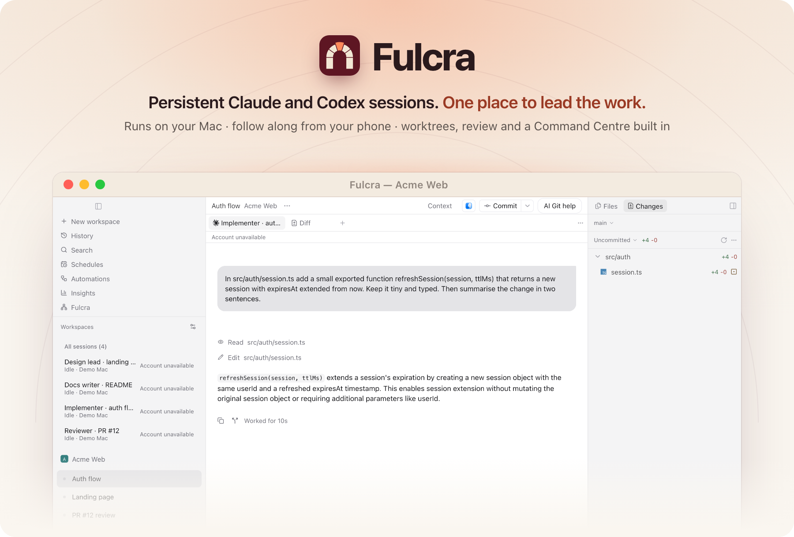
  </picture>
</p>

<p align="center">
  <a href="https://github.com/Subrising/fulcra/releases/tag/v0.2.15"></a>
  <a href="LICENSE"></a>
  
  
  
</p>

<p align="center">
  <a href="#features">Features</a> ·
  <a href="#see-it-work">Demo</a> ·
  <a href="#how-it-works">How it works</a> ·
  <a href="#install">Install</a> ·
  <a href="#quick-start">Quick start</a> ·
  <a href="#the-cli">CLI</a> ·
  <a href="#permissions-and-trust">Trust &amp; limits</a>
</p>

Fulcra keeps your Claude Code and Codex sessions running on your Mac and gives you one place to lead them. Each session keeps its conversation, its own Git worktree and its diffs. The Command Centre shows what needs you, a prime and project leads organise the work, and your phone picks up the same chat while the Mac keeps working. Your code, providers and credentials stay on the host.

## Features

<table>
  <tr>
    <td width="50%"><picture><source media="(prefers-color-scheme: dark)" srcset="docs/assets/features/sessions-dark.png">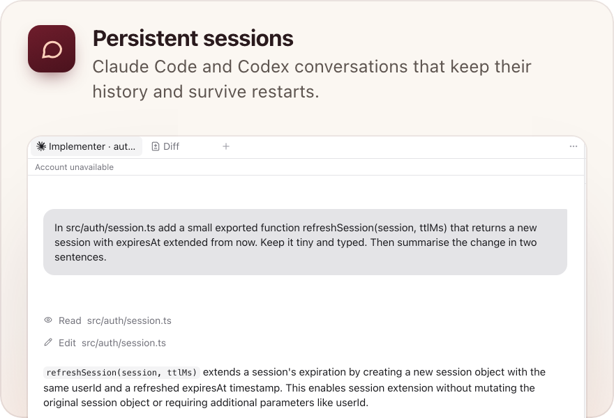</picture></td>
    <td width="50%"><picture><source media="(prefers-color-scheme: dark)" srcset="docs/assets/features/worktrees-dark.png">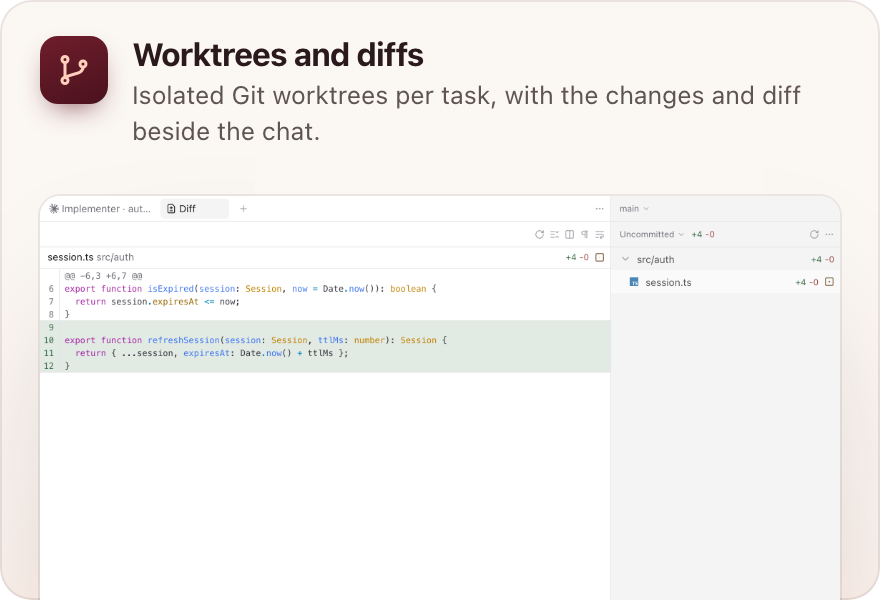</picture></td>
  </tr>
  <tr>
    <td><picture><source media="(prefers-color-scheme: dark)" srcset="docs/assets/features/providers-dark.png">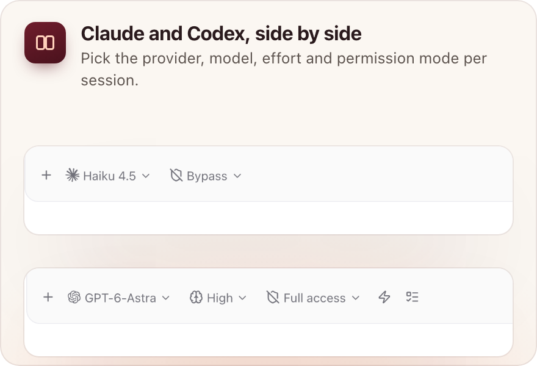</picture></td>
    <td><picture><source media="(prefers-color-scheme: dark)" srcset="docs/assets/features/today-dark.png">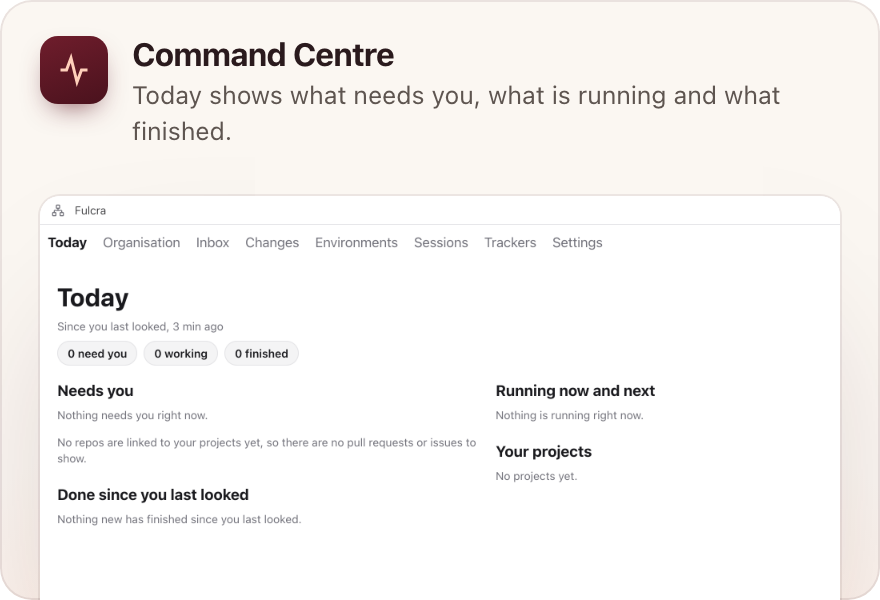</picture></td>
  </tr>
  <tr>
    <td><picture><source media="(prefers-color-scheme: dark)" srcset="docs/assets/features/leadership-dark.png">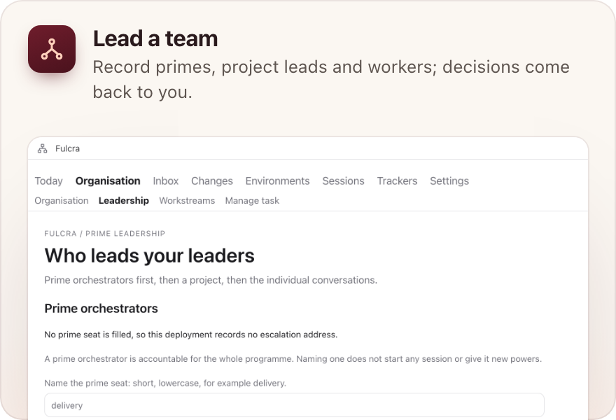</picture></td>
    <td><picture><source media="(prefers-color-scheme: dark)" srcset="docs/assets/features/accounts-dark.png">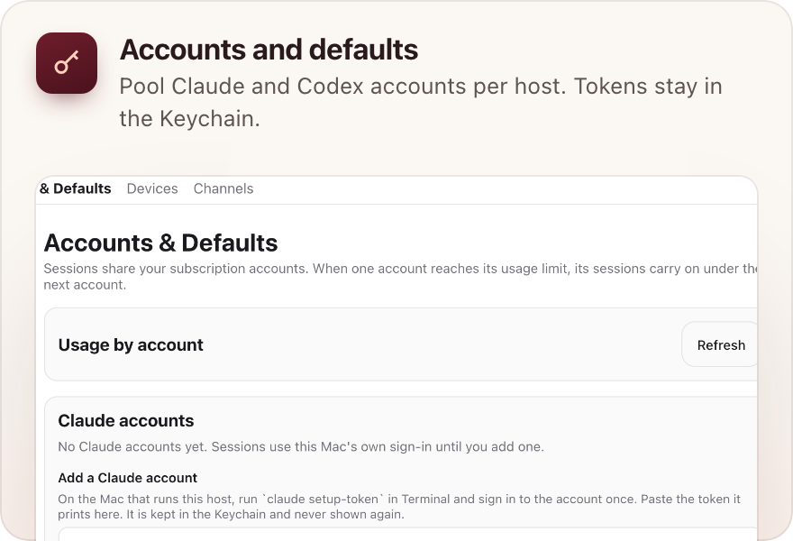</picture></td>
  </tr>
  <tr>
    <td><picture><source media="(prefers-color-scheme: dark)" srcset="docs/assets/features/phone-dark.png">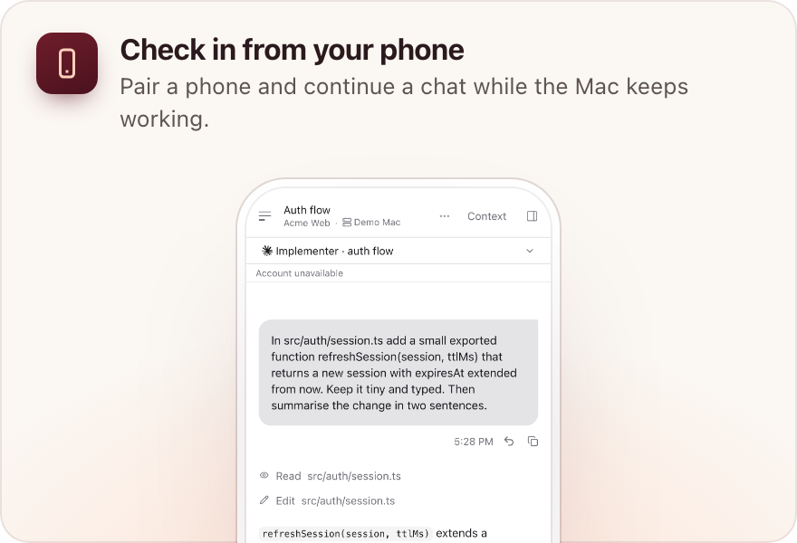</picture></td>
    <td><picture><source media="(prefers-color-scheme: dark)" srcset="docs/assets/features/git-dark.png">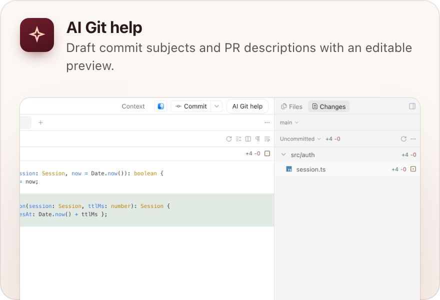</picture></td>
  </tr>
</table>

<details>
<summary><strong>Scope and limits in v0.2.0</strong></summary>

| Workflow                            | v0.2.0 scope and limits                                                                                                                                                                                                                                      |
| ----------------------------------- | ------------------------------------------------------------------------------------------------------------------------------------------------------------------------------------------------------------------------------------------------------------ |
| **Persistent sessions & worktrees** | Claude Code and Codex sessions, timelines, files, terminals, diffs and isolated worktrees. The host must stay running and reachable; provider CLIs and authentication are separate.                                                                          |
| **Lead a team**                     | Prime → project lead → worker organisation, delegated work, decisions and held messages. Each operation still checks ownership and permissions. Full native supervision and end-to-end reporting remain follow-ups.                                          |
| **Accounts & usage**                | Claude/Codex account pools, role/model defaults, session-account labels and per-account usage rundown. Unavailable readings stay unavailable. Same-chat A→B→A acceptance remains a follow-up; pools do not imply cross-host credential sync.                 |
| **Understand changes**              | Git/PR context and architecture maps derived from Archify, with [MIT attribution](packages/app/src/architecture-map/fixtures/NOTICE-archify-LICENSE.txt). Maps aid review rather than promise complete impact analysis.                                      |
| **Git AI help**                     | Commit-subject/PR-description drafts and conflict advice, with editable previews. Uses the host's default Claude account and requires workspace write permission. Subjects are limited to 72 characters; no implicit commit, PR creation or file resolution. |
| **Code review**                     | Review context and explicit GitHub approval posting pinned to the reviewed commit. Posting is separately permitted. Line-comment creation and a complete autonomous review-to-merge loop are not advertised.                                                 |
| **Plan environments**               | Radius-derived structural planning and scratch simulation. Persistent runs are default-off; native Bicep is **not included** or bundled. Real deployment and teardown remain held.                                                                           |
| **Work across devices**             | Desktop, web and compatible source-built mobile clients connect directly or through the encrypted relay. Pair and trust each host. This source-only release has no Fulcra store binary.                                                                      |
| **Guide the agents**                | Bundled Fulcra orchestration skill: one Claude copy and one shared Codex-discovered copy. Installing a skill grants no role or controller authority.                                                                                                         |

</details>

## See it work

<table>
  <tr>
    <td width="68%" valign="top">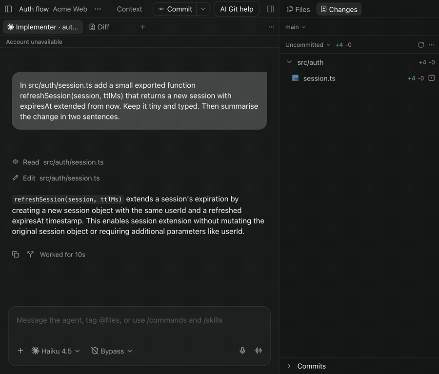<br><sub>Send a task: the agent reads, edits, and the change lands in the panel. Real turn, demo workspace, sped up 2×.</sub></td>
    <td width="32%" valign="top">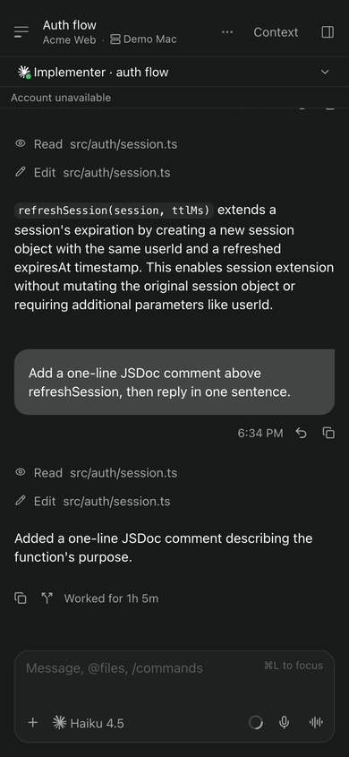<br><sub>Continue the chat at phone width. Compact layout of the web build, sped up 1.45×.</sub></td>
  </tr>
</table>

### Screenshots

<table>
  <tr>
    <td width="50%"><picture><source media="(prefers-color-scheme: dark)" srcset="docs/assets/screens/diff-dark.png">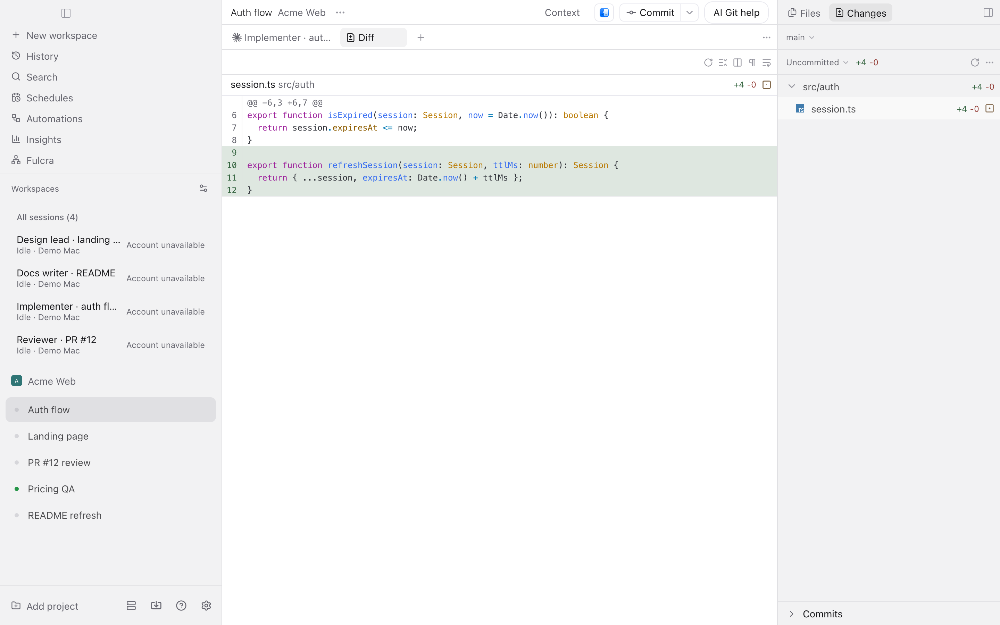</picture><br><sub>Diff and changes beside the session</sub></td>
    <td width="50%"><picture><source media="(prefers-color-scheme: dark)" srcset="docs/assets/screens/codex-dark.png">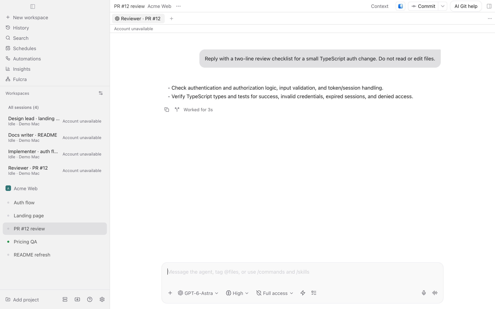</picture><br><sub>A Codex reviewer next to the Claude sessions</sub></td>
  </tr>
  <tr>
    <td><picture><source media="(prefers-color-scheme: dark)" srcset="docs/assets/screens/today-dark.png">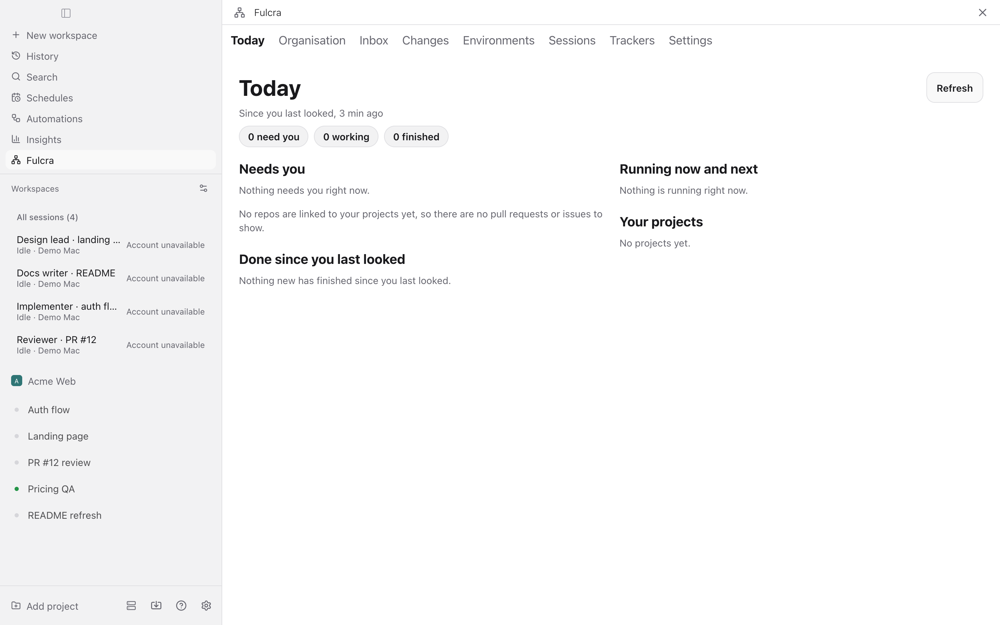</picture><br><sub>Command Centre · Today</sub></td>
    <td><picture><source media="(prefers-color-scheme: dark)" srcset="docs/assets/screens/accounts-dark.png">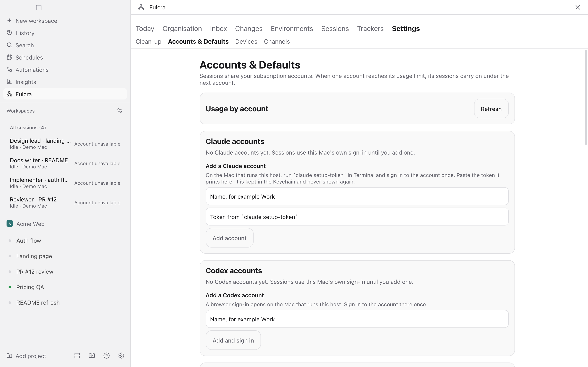</picture><br><sub>Command Centre · Accounts &amp; Defaults</sub></td>
  </tr>
</table>

<p align="center">
  <picture>
    <source media="(prefers-color-scheme: dark)" srcset="docs/assets/phone-dark.png">
    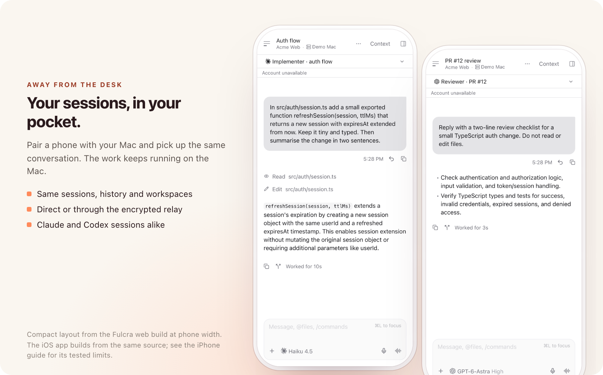
  </picture>
</p>

<sub>All screenshots are the real v0.2.0 app (desktop) and its web build (phone width) against a throwaway demo host and the demo project “Acme Web”. “Account unavailable” is shown because the demo host has no pooled accounts.</sub>

## How it works

<p align="center">
  <picture>
    <source media="(prefers-color-scheme: dark)" srcset="docs/assets/how-it-works-dark.png">
    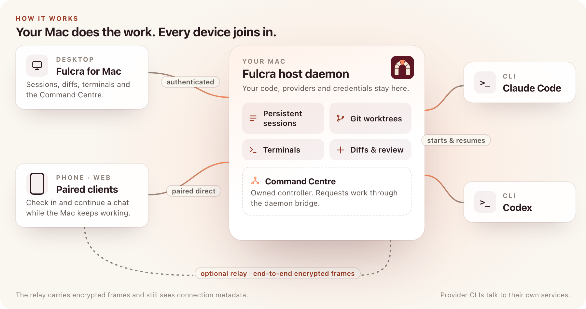
  </picture>
</p>

The daemon on your Mac owns the sessions, worktrees and terminals and starts the provider CLIs. Clients authenticate to the host. The Command Centre controller requests work through the daemon bridge; it does not bypass the daemon to acquire provider or device authority. The relay transports encrypted frames and still sees connection metadata. Provider CLIs may send prompts and code to their configured provider services.

<p align="center">
  <picture>
    <source media="(prefers-color-scheme: dark)" srcset="docs/assets/team-dark.png">
    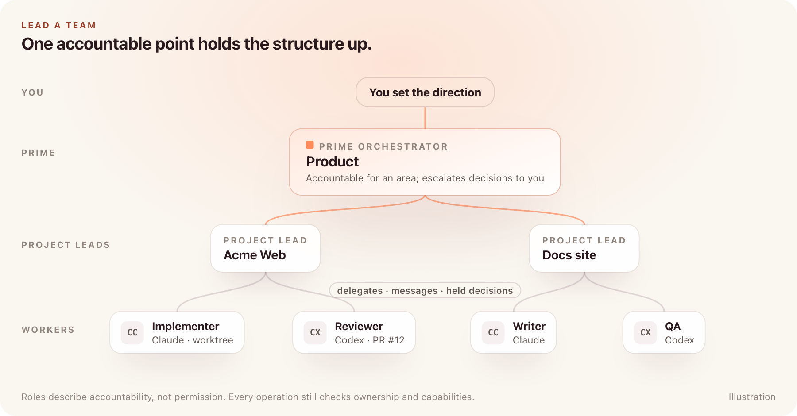
  </picture>
</p>

A **prime** leads an area, a **project lead** coordinates a project, and **workers** carry out focused jobs. Roles describe accountability, not permission: every operation still checks current ownership, capabilities and connection authority.

<p align="center">
  <picture>
    <source media="(prefers-color-scheme: dark)" srcset="docs/assets/accounts-dark.png">
    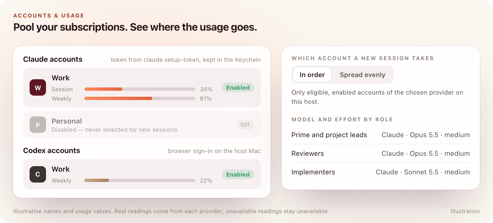
  </picture>
</p>

Pools select eligible, enabled accounts within the chosen provider on that host. Unavailable usage readings stay unknown; account choice grants no extra authority, and pools do not sync credentials between hosts. [Architecture details](docs/architecture.md) explain the host and provider boundaries.

<details>
<summary>Text diagram</summary>

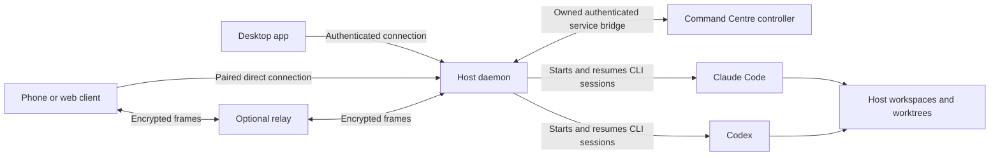
```mermaid
flowchart LR
  desktop[Desktop app] -->|Authenticated connection| daemon[Host daemon]
  phone[Phone or web client] -->|Paired direct connection| daemon
  phone <-->|Encrypted frames| relay[Optional relay]
  relay <-->|Encrypted frames| daemon
  daemon <-->|Owned authenticated service bridge| controller[Command Centre controller]
  daemon -->|Starts and resumes CLI sessions| claude[Claude Code]
  daemon -->|Starts and resumes CLI sessions| codex[Codex]
  claude --> work[Host workspaces and worktrees]
  codex --> work
```

</details>

## Install

Fulcra has no public app download. You build and package your own copy from source. The steps below make a macOS app for Apple silicon.

| Platform                  | Status                                                                                                              | Guide                                               |
| ------------------------- | ------------------------------------------------------------------------------------------------------------------- | --------------------------------------------------- |
| **macOS** (Apple silicon) | Build and package your own app (below)                                                                              | [Build, launch &amp; pair](docs/getting-started.md) |
| **iPhone**                | Tested method: Xcode with your own free Apple Account (Personal Team); onboarding taps and re-signing not exercised | [iPhone guide](docs/ios-personal-device.md)         |
| **Android**               | **Untested** source-derived APK build                                                                               | [Android guide](docs/android.md)                    |
| **Windows** (x64)         | Build, CLI and Command Centre tested on one Windows 11 PC                                                           | [Windows guide](docs/windows.md)                    |

[Platform evidence](docs/platform-installation-status.md) records what was run for each guide.

### Build and package your own Fulcra (macOS)

On Windows, do not use these steps. Use the [Windows guide](docs/windows.md). It needs Node.js 24 and npm 11 too. On Windows the built-in daemon is opt-in, so the app can open with no daemon running. To start the daemon and use Fulcra's leads and workers, enable **Command Centre** in **Settings → Advanced → Background service**.

**Prerequisites**

- A Mac with Apple silicon.
- About 30 GB of free disk space.
- Node.js 24 and npm 11. Run `node --version` and `npm --version` to check.
- Git, Python 3 and the Xcode command-line tools. To install the tools, run `xcode-select --install`.
- The provider CLIs that you want to use, for example Claude Code or Codex. Install each one and sign in to it before you start Fulcra.

**1. Clone the source**

```bash
git clone https://github.com/Subrising/fulcra.git
cd fulcra
git checkout v0.2.15
```

**2. Install the dependencies**

```bash
npm ci
npm --prefix control ci
```

The controller has its own `control/package-lock.json`. It is not a root workspace, so install both dependency trees.

**3. Build and package the app**

```bash
node scripts/package-command-centre.mjs ./control
```

This command builds the server, the Command Centre, the app and the desktop shell. It then starts the packaged app once in a scratch folder to check it. The app is at `packages/desktop/release.noindex/mac-arm64/Fulcra.app`.

**4. Sign the app**

The packaged app is not signed. Sign it with one of these two methods:

- With your own certificate (for example an "Apple Development" certificate from Xcode):

  ```bash
  security find-identity -v -p codesigning
  codesign --force --deep --sign "Apple Development: Your Name (TEAMID)" packages/desktop/release.noindex/mac-arm64/Fulcra.app
  ```

- Ad hoc (no certificate; for use on this Mac only):

  ```bash
  codesign --force --deep --sign - packages/desktop/release.noindex/mac-arm64/Fulcra.app
  ```

Then make sure that the signature is valid:

```bash
codesign --verify --deep --strict --verbose=2 packages/desktop/release.noindex/mac-arm64/Fulcra.app
```

The app is not notarised. Do not turn off the macOS security protections.

**5. First start**

1. Copy `Fulcra.app` to `/Applications`.
2. Open Fulcra. The app starts its own daemon.
3. To use Fulcra's leads and workers, enable **Command Centre** in **Settings**.
4. Continue with [Quick start](#quick-start).

An app that you build on the same Mac has no quarantine flag, so macOS opens it without a warning. If you copy the app to a different Mac, macOS can block it. In that case, open **System Settings → Privacy & Security** and select **Open Anyway**. (We did not test this case.)

A self-built app shows the base version 0.11.0-beta.5 in **About**. This is correct.

**6. Update**

1. Keep a copy of your current `/Applications/Fulcra.app`. You can go back to it if the new version has a problem.
2. In your clone, get the new version:

   ```bash
   git fetch --tags
   git checkout v0.2.15
   ```

   Use the tag of the version that you want.

3. Do steps 2, 3 and 4 again.
4. Quit Fulcra.
5. Replace `/Applications/Fulcra.app` with the new app.
6. Open Fulcra. If the daemon from the old version is still running, the new app replaces it.

We tested steps 1 to 4 from a clean clone on a MacBook Pro (Apple silicon, macOS 26) with ad hoc signing. The packaged checks passed: the app started, the daemon and the command line operated, the bundled plugins loaded and the provider models were listed.

### iPhone

Build the app in Xcode and run it on your own phone with a free Personal Team. In short: `npm run build:app-deps`, `expo prebuild --platform ios`, `pod install`, open `Fulcra.xcworkspace`, select your Personal Team under **Signing & Capabilities**, and **Run** on the device. A free-team profile lasts seven days; rebuild to re-sign (re-signing after expiry has not been tested). The [iPhone guide](docs/ios-personal-device.md) has the exact commands, tool versions and which steps were and were not exercised.

## Quick start

1. Open the app and enable **Command Centre** in Settings if you want orchestration. It starts the owned controller through the daemon.
2. In **Command Centre → Settings → Accounts &amp; Defaults**, choose accounts and the model and effort for each role.
3. Add a project, create a workspace and start a session. Check its account label and usage before delegating.
4. To connect your phone, open **Settings → your host → Pair device**, enable the relay if you need it, and scan or paste the offer in your client. Keep pairing links and QR codes private. The host must stay running.

See [Security](SECURITY.md) before connecting a device you do not control.

## The CLI

After the source build, use the compatibility executable from your checkout:

```bash
node packages/cli/bin/paseo --help
node packages/cli/bin/paseo daemon status
node packages/cli/bin/paseo ls
```

The executable is still named `paseo`; there is no separate Fulcra npm install. Select the intended host or home rather than assuming the standalone CLI uses the desktop-managed daemon. [CLI tasks and pairing](docs/getting-started.md#use-the-actual-cli) covers explicit tasks and host selection.

### Fulcra orchestration skill

Open **Settings → your host → Agents → Orchestration skills**, include **fulcra**, then install or update the selection. The bundled [Fulcra skill](skills/fulcra/SKILL.md) guides persistent sessions, delegation, messages, accounts and usage.

Claude uses `~/.claude/skills/fulcra`. Codex discovers the shared `~/.agents/skills/fulcra` copy: keep one `/fulcra` entry and do not install a second `.codex/skills` copy. Existing custom selections must include Fulcra explicitly. Installing a skill does not grant a role, manager seat or controller authority.

## Permissions and trust

New top-level sessions default to Claude `auto` and Codex `full-access` unless you override them through session, role, Settings or configuration choices. Internal helpers keep conservative modes.

**Codex Full Access runs commands without approval prompts. Fulcra cannot pre-check credential access, destructive Git actions or publishing in this mode.** The accepted v0.2.0 limitation applies to native Codex Full Access only. It does not exempt Claude, host-sync grants or future releases. Claude's credential, destructive Git and publishing approvals remain required.

Only pair trusted devices: terminals and agents can execute as the host user. Same-user processes and trusted plugins are not an OS sandbox. Mobile/web device keys remain in app storage, and desktop plugin trust depends on matching bundled and served code. See the [security model](SECURITY.md) for these boundaries.

Post-release follow-ups include complete same-chat account-switch acceptance, the remaining Full Access disclosure/device checks, and the remaining installed native supervision and reporting. These are not advertised as completed end-to-end guarantees. Persistent Radius is default-off; native Bicep and real environment deployment are outside the release. [Release notes](RELEASE-NOTES-v0.2.0.md) keep the v0.2.0 scope; the [published release](https://github.com/Subrising/fulcra/releases/tag/v0.2.0) records the final disposition.

## Contribute

Bug reports, proposals and pull requests belong in [Subrising/fulcra](https://github.com/Subrising/fulcra/issues). Start with [Contributing](CONTRIBUTING.md), [development](docs/development.md) and [plugins](docs/plugins.md). The repository keeps `packages/` for the app, daemon, CLI and libraries, `control/` for orchestration, and ignored `local/` for machine-specific configuration.

## Credits and licence

Fulcra is a modified fork of [Paseo](https://github.com/getpaseo/paseo), created by Mohamed Boudra, which it uses as its base. The root [LICENSE](LICENSE) retains **Apache-2.0**, except third-party components under their own terms; [NOTICE](NOTICE) preserves the upstream attribution and the fork's modification scope. This does not claim upstream endorsement.

Archify-derived map code and assets keep their [MIT notice](packages/app/src/architecture-map/fixtures/NOTICE-archify-LICENSE.txt). Radius is an Apache-2.0 project; structural planning does not mean its native compiler or deployment service is bundled. Other nested MIT and third-party terms remain authoritative for their components.

Internal `@getpaseo/*` package and API names, the `paseo` CLI executable and existing runtime identities remain where compatibility requires them. They are technical names, not a separate Fulcra install offer.
