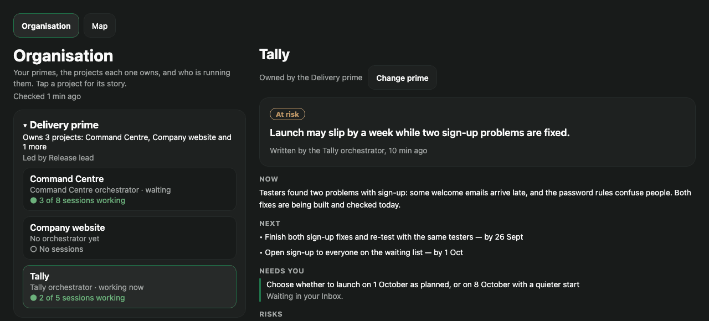
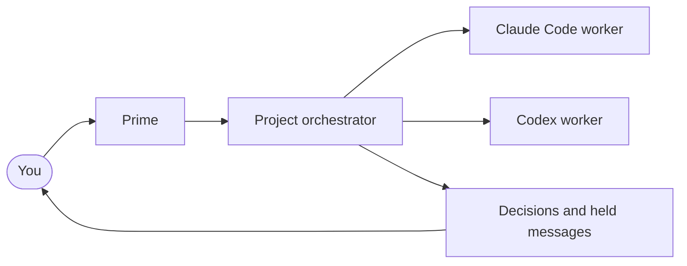
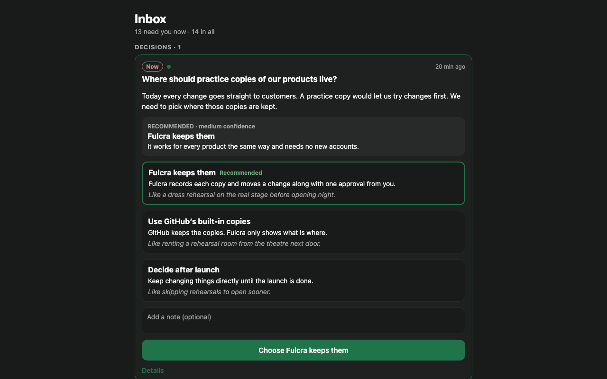
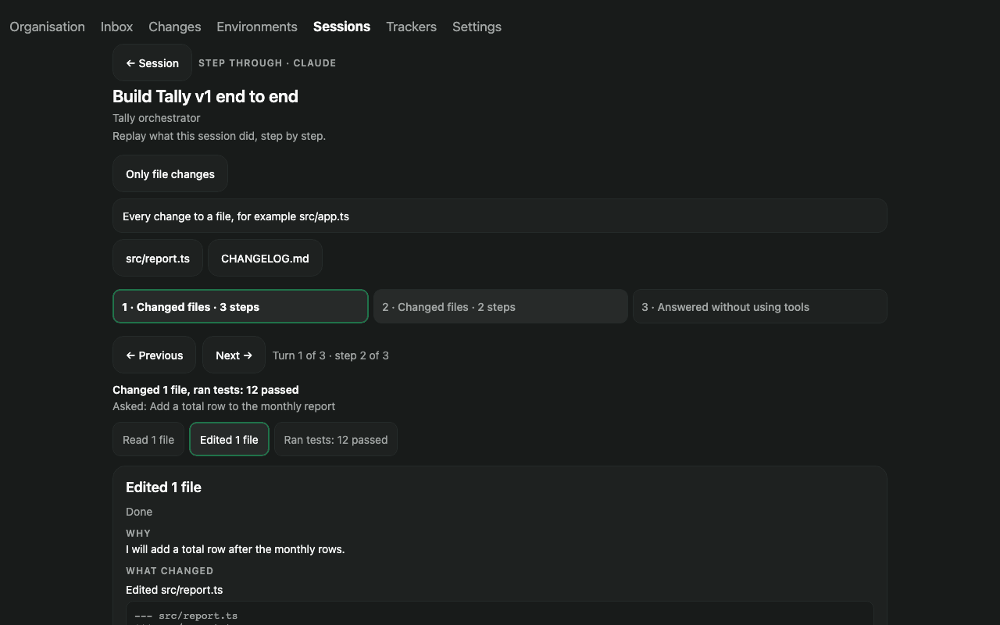
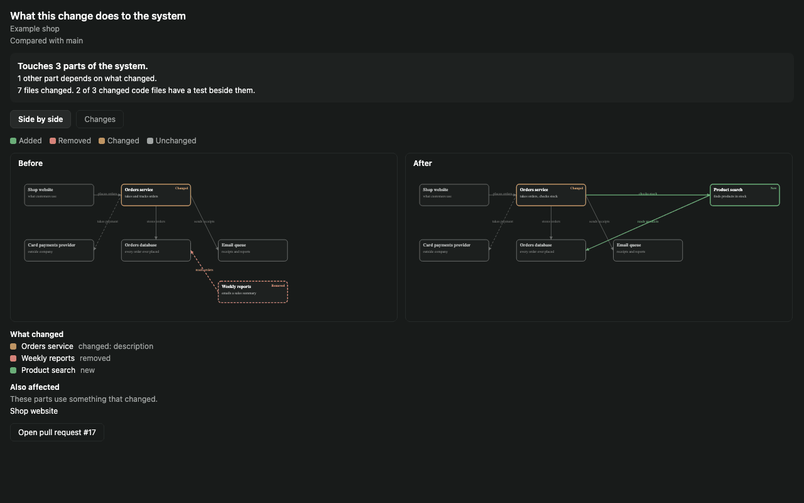
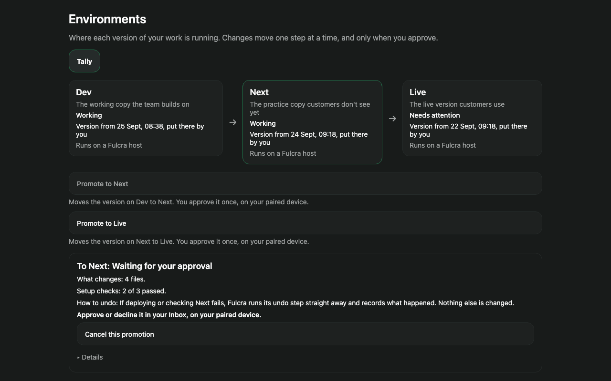
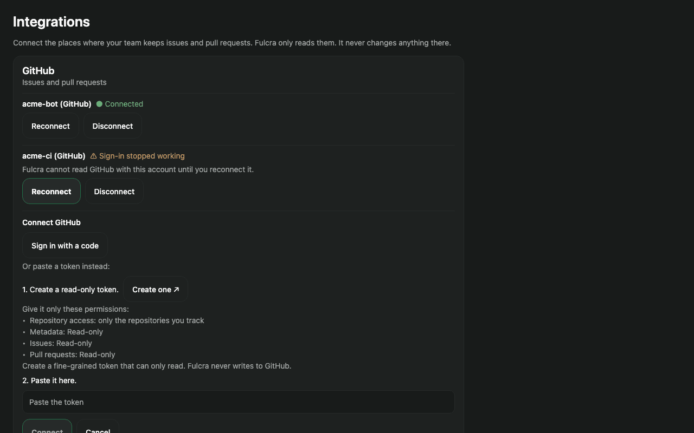

# Fulcra

**Run a team of real AI coding sessions from one place, and steer their work.**
Fulcra runs Claude Code, Codex and other agent CLIs as persistent sessions on your machine.
Use the desktop app to start sessions, follow their progress, answer decisions and inspect their work.
The Command Centre adds projects, leadership and delegated work alongside the app, host and CLI in one repository.



<sub>README images use made-up demo data. They illustrate views, not hardware acceptance evidence.</sub>

## Availability

| Area | v0.2 scope | Limits |
| --- | --- | --- |
| Sessions/workspaces | Persistent sessions, worktrees, diffs, terminals and files; session step-through | Shell-created file edits may be absent from the file-change filter. |
| Command Centre | Organisation, project/session views, Today, decisions and held messages | One-click orchestrator refresh and a complete autonomous job-to-merge loop are not established. |
| Changes | Workspace PR view and before/after architecture diagrams | Full automatic blast-radius coverage for every change is not established. |
| Environments | Planning and hold views | Production launch/teardown and automatic promotion are held. |
| Tracking | GitHub issues/PRs and existing host sign-in [C9] | Jira/Bitbucket and public Discord end-to-end workflows are not established. |
| Accounts | Multi-account Claude/Codex pool and delegated limit rotation | Manual A→B→A continuity and remote management require C9 PASS. |
| Defaults | Role/model/effort defaults; Claude auto / Codex full-access on every host [C9] | Codex Full Access runs commands without approval prompts; Fulcra cannot pre-check credential access, destructive Git actions or publishing in this mode. |
| Devices | D13 server-enforced read-only tier; explicit accounts.manage grant [C9] | Phone installation and acceptance remain unverified in this release record. |
| Platforms | Source only; macOS Apple silicon has prior test evidence | No public binary is eligible from the unsigned/non-notarized wrapper. Windows/Android not hardware-tested; Linux acceptance not established. |

`[C9]` identifies release claims awaiting candidate 9 acceptance. This README is an editorial draft until
those gates and the single-checkout artifact gates pass. See the release notes for the final supported scope.

## How work is organised

You set direction. Primes lead areas of work, project orchestrators coordinate jobs, and worker sessions
carry them out. Workers retain history and can be inspected and resumed. Generation fences reject stale
leadership after replacement; the complete one-click refresh workflow remains deferred.



Each workspace can use its own Git worktree. Fulcra shows changes and pull request status; a complete
automatic job → draft PR → review → merge → cleanup loop is not claimed for this release.

## Command Centre views

- **Organisation:** projects, leadership, sessions and work status.
- **Inbox / Today:** decisions, held messages and work that needs attention. A failed read must not appear as all clear.
- **Sessions:** follow a conversation and inspect its turns and tools. [C9] Pending approvals show “Needs you”.
- **Changes:** inspect workspace changes and before/after architecture views.
- **Environments:** inspect plans and holds before operational action.
- **Trackers:** view GitHub work; [C9] identify your work using the host's existing gh sign-in, without copying its token.







## Accounts and defaults

Settings → Accounts & Defaults manages pooled Claude and Codex accounts, priorities and enabled state.
Delegated sessions can continue on another eligible account after a usage limit; human-held sessions are
marked limited rather than silently moved.

[C9] Switch a session using “Switch account…” or `/account`. The same session and history must continue.
Remote switching requires an owner-granted `accounts.manage` capability in Settings → Devices, separate
from Command Centre access. Existing devices receive no account-management grant on upgrade. Until C9
passes, takeover is supported from the Mac hosting the session. D13 read-only devices cannot manage accounts.
Remote add/remove remains conditional on exact acceptance. C9 host settlement is ENABLEMENT-ONLY: source
contains Keychain diagnostics/readback, owned app-managed restart and a staged adapter gate. Packaged
integration and prime app-context acceptance remain NOT_RUN. Pool coordination, writer leases, enrollment,
host-sync grants and cross-host sync remain unimplemented/HOLD, outside C9; no sync completion is claimed.

Models come from the provider catalog. Role defaults are editable; an explicit model/effort choice wins.
[C9] New top-level sessions default to Claude `auto` / Codex `full-access`, including plain hosts. Internal
helpers retain conservative modes. Daemon-created children inherit restrictions; controller-brokered worker
clamping remains a documented gap. Claude `bypassPermissions` is refused.

**Codex Full Access runs commands without approval prompts. Fulcra cannot pre-check credential access,
destructive Git actions or publishing in this mode.** This enforcement gap (L52) is an accepted limitation
for v0.2.0 native Codex FullAccess only, conditional on this release disclosure and matching help text in
Settings → Accounts & Defaults. It does not exempt Claude, host-sync grants or future releases.

Claude Auto must still pass the credential/Keychain, destructive shared-branch Git and publishing/release
approval gates [C9]. Ordinary MCP/tool calls should need no Fulcra approval under the automatic defaults
[C9]. Fulcra management tools and host-sync operations retain their separate authorization checks.

[C9] Integrated source includes pooled Claude and Codex readers, session-account attribution and a
per-account rundown in chat and Settings, with unavailable states, reset/status figures and bounded
refresh/cache behavior. The C9 rundown gate is source-delivered. Packaged gate and UI acceptance remain
NOT_RUN until bound to the exact seal; this is implementation scope, not shipped or live-provider acceptance.

Native queued intercom and prime report-up are IMMEDIATE-NEXT, outside the a768 C9 artifact scope. No
queued-delivery or report-up completion is claimed for that artifact.

## Source-only release

v0.2 defaults to source only. The current packaging wrapper disables signing and notarization and is
ineligible for public `.app`, `.dmg` or `.zip` binary assets under this release’s signing requirement.
A future binary requires signing evidence accepted by the release owner and hash-bound artifact gates.
Build from source using the instructions below; no public binary download or checksum is claimed here.

Use matching bundled/served plugin bytes on all Macs using the desktop Command Centre. Version skew can
show “Plugin not trusted on this Mac”. Pair devices and grant capabilities explicitly when configuring
a developer-built installation.

Mobile/web relay identity keys remain plaintext; desktop storage is protected but the renderer holds the
key in memory while connected. Mobile/web also lack the desktop bundled-plugin pin. See release notes for
same-user/plugin trust, platform and other security limits.

## One repository

```text
packages/     App, desktop, host/server, CLI and shared libraries
control/      Controller, Command Centre plugin, ingress, provider integration and tools
local/        Ignored machine configuration and local operational state
scripts/      Product build and packaging entry points
```

Use tracked `*.example` templates to create your own configuration under `local/`. Keep machine hostnames,
device IDs, pins/grants, controller homes, receipts, credentials, evidence and local release folders out of
the tracked tree. Examples and tests use placeholders. Moving config to `local/` does not change installed
runtime identities or move existing user data automatically. Follow the final control setup guide for the
supported config-loader/template commands; do not assume merely copying a file activates it.

## Build from source

Use Node.js 22+ and npm; Node.js 24 matches the controller bundle target. For macOS desktop packaging,
install the Xcode command line tools. Python 3 is needed for the control tools that use it.
From the repository root:

```bash
git clone https://github.com/Subrising/fulcra.git
cd fulcra
npm ci
npm run typecheck
npm run build:server
node scripts/package-command-centre.mjs ./control
```

The unsigned Command Centre wrapper builds the server, bundled plugin/controller, web app and desktop app
from this checkout and outputs an app directory under `packages/desktop/release/` (normally
`mac-arm64/Fulcra.app`). It disables signing, notarization and hardened runtime; it does not produce a DMG/ZIP
or prove packaged launch/upgrade acceptance. This command retains the current wrapper's explicit controller
argument; use it only after the consolidation owner confirms its one-checkout path/provenance adaptations.
Generic `build:unsigned` does not itself establish that the Command Centre bundle was rebuilt.

Development uses `npm run dev` for the host, `npm run dev:app` for the shared app, or `npm run dev:desktop`
for desktop development. These are separate processes; root `dev` does not start both host and app.

```bash
fulcra daemon status # paseo remains a compatibility alias
```

The standalone CLI's default state home remains `~/.paseo`; existing `FULCRA_HOME`/`PASEO_HOME` compatibility
is retained. Desktop uses its existing app user-data daemon directory unless overridden. Keep the desktop
bundle ID `dev.orca.workspace.desktop`, macOS data directory `~/Library/Application Support/Orca`, Keychain
service names, socket paths, runtime environment variable names and trusted plugin IDs unchanged.

Release builds use the candidate pipeline, recording the single-checkout commit and product/control lineage,
then sealing/scanning/testing the exact output. A successful source build is not a public release verdict.

## Staying current with Paseo

Fulcra is a fork of [Paseo](https://github.com/getpaseo/paseo), with additional orchestration/control code.
Keep the `upstream` remote pointing to getpaseo/paseo for future merges. Retain compatible upstream package
names and runtime identities. Correct the identity inventory in [docs/UPSTREAM.md](docs/UPSTREAM.md) when
consolidating: its old `app.fulcra.desktop` / Application Support/Fulcra description is not the v0.2 runtime.
Describe the sync script/workflow as active only if it is present and validated in the published tree.

## Credits and licences

Fulcra is based on Paseo by Mohamed Boudra, under Apache-2.0. See [LICENSE](LICENSE) and [NOTICE](NOTICE).
Preserve upstream copyright and applicable third-party notices in source and binary distributions, and
mark modified source files. Fulcra does not claim endorsement by the Paseo project.

The architecture-map approach draws on Archify (MIT); environment planning draws on Radius (Apache-2.0).
Retain their licences/notices wherever code/assets are actually incorporated. Kepler inspires the session
step-through approach; it is proprietary, unaffiliated, and none of its code or assets is included.
