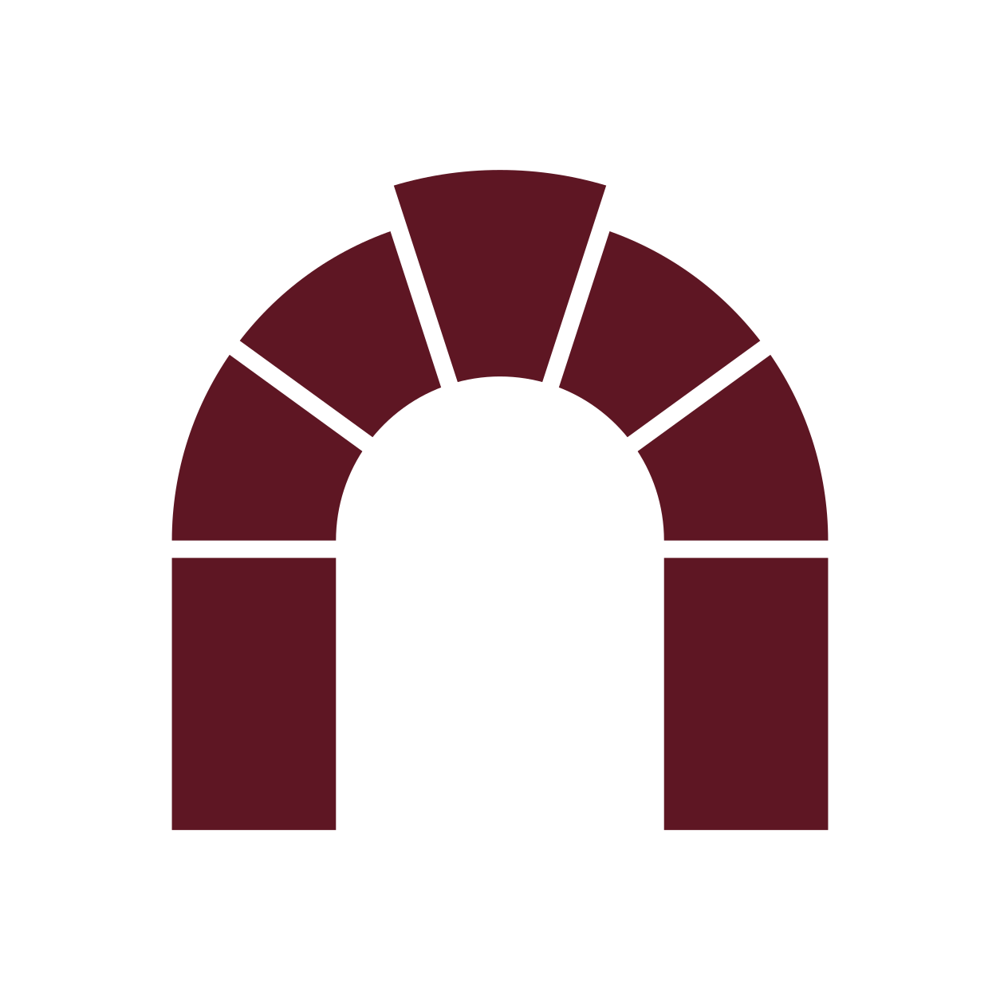
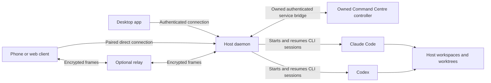
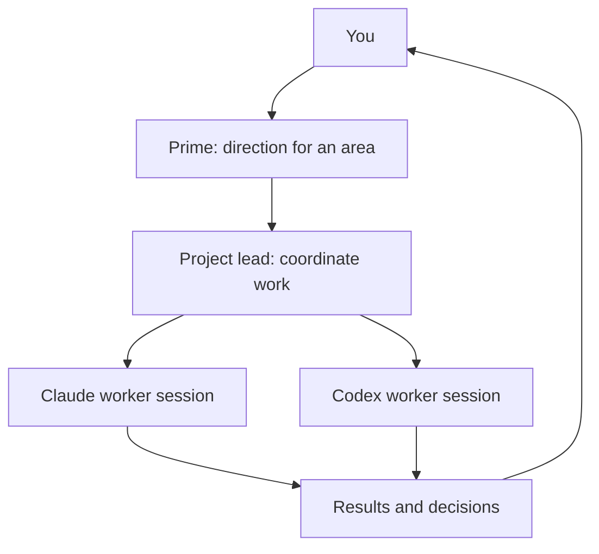
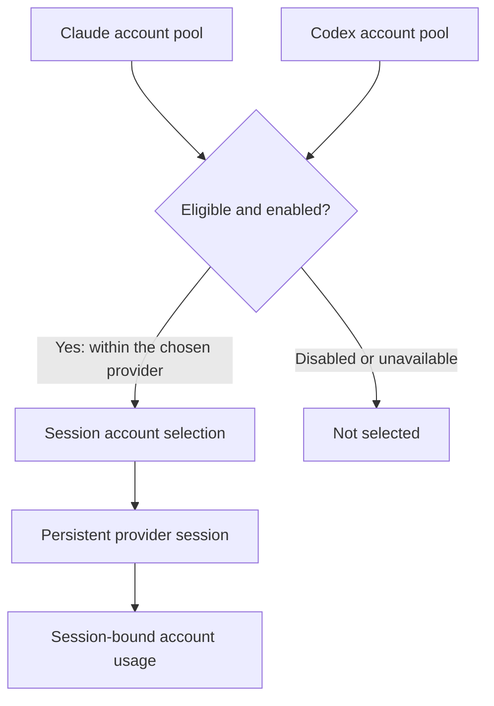

<p align="center">
  
</p>

<h1 align="center">Fulcra</h1>

<p align="center"><strong>Persistent Claude and Codex sessions. One place to lead the work.</strong></p>

<p align="center">
  Run your coding sessions on your Macs. Organise the team, inspect its work, and check in from your phone while the host stays running.
</p>

<p align="center">
  <a href="#get-started">Get started</a> ·
  <a href="#what-you-can-do">Features</a> ·
  <a href="#how-it-connects">Architecture</a> ·
  <a href="#fulcra-orchestration-skill">Skill</a> ·
  <a href="#permissions-and-trust">Trust & limits</a> ·
  <a href="https://github.com/Subrising/fulcra/releases/tag/v0.2.0">v0.2.0 source release</a>
</p>

Fulcra brings persistent sessions, isolated Git worktrees and an owned Command Centre into one app. Give a session a task, keep its conversation, and return to the same work from another connected device. Use a prime to lead an area, a project lead to coordinate it, and workers to carry out focused jobs.

Your providers and development environment run on the selected host. Fulcra connects the views and the work; it does not turn a role label or an AI suggestion into permission.

## What you can do

| Workflow | v0.2.0 scope and limits |
| --- | --- |
| **Persistent sessions & worktrees** | Claude Code and Codex sessions, timelines, files, terminals, diffs and isolated worktrees. The host must stay running and reachable; provider CLIs and authentication are separate. |
| **Lead a team** | Prime → project lead → worker organisation, delegated work, decisions and held messages. Each operation still checks ownership and permissions. Full native supervision and end-to-end reporting remain follow-ups. |
| **Accounts & usage** | Claude/Codex account pools, role/model defaults, session-account labels and per-account usage rundown. Unavailable readings stay unavailable. Same-chat A→B→A acceptance remains a follow-up; pools do not imply cross-host credential sync. |
| **Understand changes** | Git/PR context and architecture maps derived from Archify, with [MIT attribution](packages/app/src/architecture-map/fixtures/NOTICE-archify-LICENSE.txt). Maps aid review rather than promise complete impact analysis. |
| **Git AI help** | Commit-subject/PR-description drafts and conflict advice, with editable previews. Uses the host's default Claude account and requires workspace write permission. Subjects are limited to 72 characters; no implicit commit, PR creation or file resolution. |
| **Code review** | Review context and explicit GitHub approval posting pinned to the reviewed commit. Posting is separately permitted. Line-comment creation and a complete autonomous review-to-merge loop are not advertised. |
| **Plan environments** | Radius-derived structural planning and scratch simulation. Persistent runs are default-off; native Bicep is **not included** or bundled. Real deployment and teardown remain held. |
| **Work across devices** | Desktop, web and compatible source-built mobile clients connect directly or through the encrypted relay. Pair and trust each host. This source-only release has no Fulcra store binary or hardware-tested phone release claim. |
| **Guide the agents** | Bundled Fulcra orchestration skill: one Claude copy and one shared Codex-discovered copy. Installing a skill grants no role or controller authority. |

## Get started

**v0.2.0 is a source-only release.** Its [GitHub release](https://github.com/Subrising/fulcra/releases/tag/v0.2.0) has no uploaded binary assets. Use [the tagged source](https://github.com/Subrising/fulcra/tree/v0.2.0) or the [source ZIP](https://github.com/Subrising/fulcra/archive/refs/tags/v0.2.0.zip). There is no Fulcra DMG, Homebrew formula or published Fulcra npm package to install from this release.

For a macOS Apple silicon desktop build, prepare Node.js 24, npm 11.12.1, Python 3 and the Xcode command-line tools. Install and authenticate the provider CLIs you intend to use separately.

```bash
git clone https://github.com/Subrising/fulcra.git
cd fulcra
git checkout v0.2.0
npm ci
npm --prefix control ci
node scripts/package-command-centre.mjs ./control
```

The controller uses its own `control/package-lock.json` and is not a root workspace. Install both dependency trees: the wrapper builds them but does not install control dependencies.

The committed wrapper builds the server, Command Centre, app and desktop from this checkout. Its macOS arm64 output is `packages/desktop/release/mac-arm64/Fulcra.app`. It deliberately produces an **unsigned, unnotarised** developer build. Open your own built app using macOS's individual-app first-open flow; do not disable macOS security protections globally.

Then:

1. Open the app and enable **Command Centre** in Settings if you want orchestration. It starts the owned controller through the daemon and restarts the background service as needed.
2. Configure your host's **Accounts & Defaults**. Choose the provider/account, model and permission mode for your work.
3. Create a workspace and a session. Inspect its account label and usage before delegating.
4. To connect your phone, use **Settings → your host → Pair a device**, enable relay when appropriate, and scan or paste the offer in your compatible client. Keep pairing links and QR codes private. The host must stay running.

See [Build, launch & pair](docs/getting-started.md) for development commands, the actual repo-local CLI and the skill setup. See [Security](SECURITY.md) before connecting a device you do not control.

### The repo-local CLI

After the source build, use the actual compatibility executable from this checkout:

```bash
node packages/cli/bin/paseo --help
node packages/cli/bin/paseo daemon status
node packages/cli/bin/paseo ls
```

The executable remains `paseo`; there is no separate Fulcra npm install implied. Select the intended host/home rather than assuming the standalone CLI uses the desktop-managed daemon. See [CLI tasks and pairing](docs/getting-started.md#use-the-actual-cli) for explicit tasks and host selection.

## Fulcra orchestration skill

Open **Settings → your host → Agents → Orchestration skills**, include **fulcra**, then install or update the selection. The bundled [Fulcra skill](skills/fulcra/SKILL.md) guides persistent sessions, delegation, messages, accounts and usage.

Claude uses `~/.claude/skills/fulcra`. Codex discovers the shared `~/.agents/skills/fulcra` copy: keep one `/fulcra` entry and do not install a second `.codex/skills` copy. Existing custom selections must include Fulcra explicitly. Installing a skill does not grant a role, manager seat or controller authority.

## How it connects



The controller requests work through the daemon bridge; it does not bypass the daemon to acquire provider or device authority. Clients authenticate to the host. The relay transports encrypted frames and still sees connection metadata. Provider CLIs may send prompts and code to their configured provider services.

### Team accountability



Roles describe accountability, not permission. Each operation still checks current ownership, capabilities and connection authority.

### Host account pools



Pools select eligible enabled accounts within the chosen provider on that host. Unavailable usage readings stay unknown; this does not claim automatic cross-host credential sync or completed same-chat A→B→A acceptance. Account choice grants no extra authority. [Architecture details](docs/architecture.md) explain the host and provider boundaries.

## Permissions and trust

New top-level sessions default to Claude `auto` and Codex `full-access` unless you override them through session, role, Settings or configuration choices. Internal helpers retain conservative modes.

**Codex Full Access runs commands without approval prompts. Fulcra cannot pre-check credential access, destructive Git actions or publishing in this mode.** The accepted v0.2.0 limitation applies to native Codex Full Access only. It does not exempt Claude, host-sync grants or future releases. Claude's credential, destructive Git and publishing approvals remain required.

Only pair trusted devices: terminals and agents can execute as the host user. Same-user processes and trusted plugins are not an OS sandbox. Mobile/web device keys remain in app storage, and desktop plugin trust depends on matching bundled and served code. See the [security model](SECURITY.md) for these boundaries.

Post-release follow-ups include complete same-chat account-switch acceptance, the remaining Full Access disclosure/device checks, and the remaining installed native supervision and reporting. These are not advertised as completed end-to-end guarantees. Persistent Radius is default-off; native Bicep and real environment deployment are outside the release. [Release notes](RELEASE-NOTES-v0.2.0.md) retain the v0.2.0 candidate scope; the [published release](https://github.com/Subrising/fulcra/releases/tag/v0.2.0) records the owner's final disposition.

## Contribute

Bug reports and proposals belong in [Subrising/fulcra](https://github.com/Subrising/fulcra/issues). Start with [Contributing](CONTRIBUTING.md), [development](docs/development.md) and [plugins](docs/plugins.md). The repository keeps `packages/` for the app, daemon, CLI and libraries, `control/` for orchestration, and ignored `local/` for machine-specific configuration.

## Credits and licence

Fulcra is a modified fork of [Paseo](https://github.com/getpaseo/paseo), created by Mohamed Boudra. The committed root [LICENSE](LICENSE) retains **Apache-2.0**, except third-party components under their own terms; [NOTICE](NOTICE) preserves the upstream attribution and fork modification scope. This presentation change does not relicense the project or claim upstream endorsement.

Archify-derived map code/assets retain their [MIT notice](packages/app/src/architecture-map/fixtures/NOTICE-archify-LICENSE.txt). Radius is an Apache-2.0 project; structural planning does not mean its native compiler or deployment service is bundled. Other nested MIT and third-party terms remain authoritative for their components.

Internal `@getpaseo/*` package/API names, the `paseo` CLI executable and existing runtime identities remain where compatibility requires them. They are technical names, not a separate Fulcra install offer.
