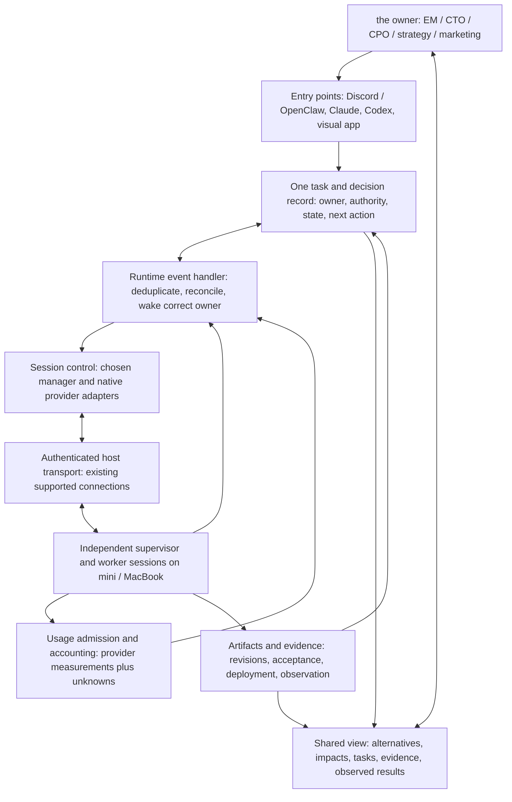

# Architecture and requirements

## The outcome

Fulcra should make the owner more effective at directing work and understanding consequences. Success is useful, verified output with less intervention and justifiable cost. Session counts, attractive graphs and test counts are supporting measures.

The central work unit is a **persistent first-class session** with its own identity, conversation, working context and resume handle. A task can move between sessions; a session can work across multiple task turns. A supervisor is a role assigned to one of those sessions, not a mandatory vendor or permanent root process. Disposable in-process subagents cannot substitute for these sessions.

Start with one supervisor and two workers. Grow toward two or three independently resumable supervisors and a larger saved-session pool only after measuring overhead. “Live” means explicitly distinguishing connected idle sessions, active model turns, tool-running sessions, waiting sessions and saved disconnected sessions. Ten to fifteen saved sessions per family does not require that many simultaneous model turns.

## Requirements map

| ID  | Foundation requirement                                                                                | Evidence required for acceptance                                                                                                          |
| --- | ----------------------------------------------------------------------------------------------------- | ----------------------------------------------------------------------------------------------------------------------------------------- |
| F1  | Claude, Codex and OpenClaw communicate in both directions; same-family and cross-Mac routes also work | Recipient acknowledgment plus a task-specific action, correlated with the originating message                                             |
| F2  | Persistent independent sessions                                                                       | Same identity/context can resume; supervisor interruption does not destroy workers or assign a second owner                               |
| F3  | Outcome ownership                                                                                     | One accountable owner per task; explicit scope, dependencies, acceptance criteria and next action                                         |
| F4  | Event-driven continuation                                                                             | Completion/help/permission events reach a handler and start the appropriate action without the owner chasing                              |
| F5  | Distinct execution states                                                                             | Queued, delivered, consumed, started, waiting, interrupted, produced, accepted and live-verified are separate facts                       |
| F6  | Routine permissions                                                                                   | Exact prompt identity, authority check, response and resumed work; two different prompts both handled; repeats do not repeat actions      |
| F7  | Human coexistence                                                                                     | Human-owned observation, delegated control and explicit takeover/handback; human takeover fences agent writes                             |
| F8  | Non-Git work                                                                                          | Produce, revise, reopen and inspect a useful editable artifact in a plain directory                                                       |
| F9  | Continuity                                                                                            | Reconnect, process restart and supervisor handoff retain responsibility and reconcile uncertain delivery without replaying completed work |
| F10 | Cost discipline                                                                                       | Admission follows actual headroom; runtime waiting is cheap; usage provenance and measurement gaps are visible                            |
| F11 | One operational story                                                                                 | Automation and UI derive task status from the same accepted records and session observations                                              |
| F12 | Portable interfaces                                                                                   | Changing Discord/app/CLI entry point preserves task identity, decisions and control ownership                                             |

| ID  | Human and work-discipline requirement      | Practical implementation contract                                                                                               |
| --- | ------------------------------------------ | ------------------------------------------------------------------------------------------------------------------------------- |
| H1  | Understand before consequential action     | Show current situation, alternatives, consequences, uncertainty, recommendation and decision deadline                           |
| H2  | Execute / decide / understand are distinct | Three explicit fields on a workstream; an informational brief need not create an approval gate                                  |
| H3  | Proportionate ADW                          | Understand → alternatives → choose → produce → review → correct/simplify → deliver → verify → retain learning                   |
| H4  | Inspectable work                           | Outcome, dependency, owner, model, host, confirmed state/time, blocker, next action, usage, output and evidence links           |
| H5  | Trace decisions into reality               | Reviewed definition → exact implementation/artifact → deployment when applicable → observed behavior, with mismatches visible   |
| H6  | Develop judgment                           | Optional the owner-first judgment on selected decisions, sampled delegated decisions, and later outcome review                  |
| H7  | Appropriate domain checks                  | Software behavior; document accuracy/usability/persistence; playable media with audio checks; decision uncertainty and outcomes |
| H8  | Respect existing responsibility            | Programme holds, repair ownership, accepted artifacts and private-data boundaries persist across interfaces                     |

The later frontier backlog is preserved separately: portable supervisor; leadership council; shadow preference delegate; parallel futures; portfolio proposals; workflow learning; temporary team sizing; cross-project memory; synthetic federation; active preference learning. These are experiments after a functioning foundation, not ten concurrently authorized projects.

## What the Reddit examples contribute

All twelve supplied images were viewed. Images 2, 5–8 and 11 describe a named manager, a mission note, internal tickets, durable memory and periodic proactive work. Images 1 and 6 show explicit working rules and review expectations. Images 4, 9, 10 and 12 include disclosure/discussion of Scape and automatically generated summaries. Image 3 is a skill-repository popularity graphic, not evidence of orchestration reliability.

Adopt the useful patterns: a durable queryable work history, a concise mission and playbook, source-linked learning, task-appropriate review, and an agent proposing valuable follow-up work. Archive closed tasks instead of erasing their history. Retrieve relevant precedents rather than broadcasting whole transcripts.

Do not turn the screenshots' 90-minute heartbeat into a default schedule. It illustrates proactive intent, but does not prove wake reliability. Do not adopt the model IDs, ticket counts, skills or spend claims without verification. The supplied summaries disagree about subscription spending; they are not a budget baseline. No Scape purchase or installation is recommended by this research.

## Responsibility diagram

This is a proposed responsibility map, not a running deployment. Several boxes should live inside the same existing product.

**Session control** owns start, send, steer, stop and resume. **Transport** moves authenticated requests between hosts. **Events/wake** turns a runtime observation into an action by the responsible session. **Task ownership** decides who may act and what counts as done. **Usage** admits work and measures it. **Evidence/decisions** binds reasoning and results. **UI** projects those records. None of these responsibilities makes an LLM the permanent authority.

The first proof should use native product state plus a small evidence file. Before implementing a durable integration, resolve whether Paperclip/AIN or another installed store already owns the authoritative task record. If so, use its supported API. If none fits, the fallback is one small transactional store owned by one process; SQLite is an implementation option, not the product goal. Do not synchronize multiple writable task boards or share a raw SQLite file between Macs.

The existing OpenClaw programme owner has now confirmed the retained responsibility model: AIN for mission/leadership/team ownership, Paperclip for work-board accountability, ADW contracts for outcomes/review, and runtime/Bridge for delivery/wake/permissions. Current Paperclip board state and integration APIs were not verified. This is enough to avoid assigning those responsibilities to a new store by default, but not enough to claim the installed board already implements the proposed event contract.

## Architecture choices

| Option                        | Composition and responsibility                                                                                                                                                            | Strength                                                                                                | Main unknown / switch trigger                                                                                                     |
| ----------------------------- | ----------------------------------------------------------------------------------------------------------------------------------------------------------------------------------------- | ------------------------------------------------------------------------------------------------------- | --------------------------------------------------------------------------------------------------------------------------------- |
| A — recommended first trial   | Paseo owns enrolled session lifecycle and conversation UI; existing task authority owns outcomes; a bounded event integration covers only proven gaps; OpenClaw is a peer and entry point | Reuses a coherent multi-provider product with non-Git directories, remote operation and permission APIs | Standalone-session wake, human enrollment/takeover, and reconnect recovery must pass without recreating a controller              |
| B — first alternative         | AI Maestro owns discovery, AMP transport and its existing session/team view; existing provider controls execute; one chosen task store owns workflow                                      | Stronger fit when already-running heterogeneous terminals across machines are non-negotiable            | Provider-specific wake/approval behavior and exclusive control must pass; no assumption that pane-visible text was consumed       |
| C — second alternative        | Native Codex App Server and Claude native/ACP interfaces; reuse existing OpenClaw routes; minimal correlation/ownership integration                                                       | Preserves native sessions and minimizes migration if current integrations already do enough             | More integration work and less unified UI; native events alone do not schedule a cross-family supervisor                          |
| D — visual-product challenger | Kepler or AO owns managed tasks and their view, only if adequate external-session control APIs are demonstrated                                                                           | Rich human inspection; both have evidence of some non-Git support                                       | No verified general API for the required independent external-session lifecycle; do a bounded API check, not a new platform build |

The recommendation is qualitative, using hard requirements rather than a cosmetic weighted score. A candidate that cannot handle two distinct permissions or honor takeover fails regardless of its UI. A requires the fewest hypothesized components for **new enrolled sessions**. B may win when preserving existing arbitrary terminal sessions is the primary constraint. C may win if the existing owner's response shows the remaining integration is already small. D stays a real challenger, not a dismissed category.

### Standalone sessions change the Paseo proposal

Paseo's released code contains parent-archive handling that can cascade to children, with conditional detachment. The CLI provides explicit detach while keeping the agent running. Therefore default parent-created workers must not be treated as automatically independent. [Released lifecycle implementation](https://github.com/getpaseo/paseo/blob/v0.8.0/packages/server/src/server/agent/agent-manager.ts), [released CLI](https://github.com/getpaseo/paseo/blob/v0.8.0/public-docs/cli.md).

Prefer creating independent top-level sessions through a supported manager/API entry and recording the supervisor-task relationship outside destructive parent lifecycle. Confirm the exact release behavior before running the proof. Detaching a child is a possible migration action only for explicitly owned test sessions, and loses any assumed parent-notification guarantee. A standalone worker therefore needs an explicitly tested event subscription and wake route. Parent completion demos alone cannot pass this requirement.

### What to reuse, retain, replace and avoid

| Treatment                                    | Scope                                                                                                                                                                                                    |
| -------------------------------------------- | -------------------------------------------------------------------------------------------------------------------------------------------------------------------------------------------------------- |
| Reuse                                        | Existing legitimate Claude/Codex authentication contexts, supported native resume handles, accepted document/video outputs as comparators, existing task authority if suitable, current host connections |
| Retain under current owner                   | Bridge/continuity and usage repair, original Claude workers/reviewers, existing worktrees, unresolved spreadsheet checkpoint, Radius holds                                                               |
| Replace only after proof and owner agreement | A demonstrated brittle terminal-control or wake function that a selected product actually handles better                                                                                                 |
| Avoid building now                           | Generic agent framework, new terminal renderer, credential broker, second writable board, universal transcript warehouse, polling-model fleet, broad memory graph, custom diagram engine                 |

## Leadership view and decision-to-result chain

Use three levels of detail. The portfolio view shows outcomes, commitments, blockers, attention needed and cost. The workstream view shows alternatives, owner, dependencies, next action and latest evidence. The session view shows conversations, tools, files and actual runtime observations. A model-generated summary is labeled as such; disconnected or old observations show their timestamp and uncertainty.

For consequential decisions, produce a small decision packet before execution:

1. Outcome and current situation, with source/evidence links.
2. Two or three credible alternatives, including defer/do nothing where meaningful.
3. Expected benefits, cost, time, dependencies, security/privacy and reversibility.
4. Recommendation, uncertainty and what would change it.
5. Separate execution authority, decision authority and what the owner should understand.
6. Reviewed scope/acceptance criteria, linked to later artifacts and observed outcomes.

Role views change emphasis without changing the underlying facts: CTO sees architecture and operational implications; EM sees capacity, dependencies and delivery; CPO sees user value and opportunity cost; strategy/marketing sees positioning, assumptions and expected outcomes. Do not invent specialized autonomous executives just to populate the view.

the owner clarified the default policy: vision, major design and cross-system impacts warrant alternatives and understanding before action; plan approval can help align some new workstreams; routine work with few meaningful alternatives and little breakage potential should frequently proceed within delegated limits. Recommend Discord/OpenClaw first for phone conversation, paired with the chosen existing mobile/web view. Verify task/decision continuity from the phone rather than making a separate mobile controller.

**Archify identity evaluated:** `tt-a1i/archify`, matching the Before/Delta/After and evidence-oriented brief. The unrelated architecture-recommender paper and browser extension with the same name are excluded. Evaluate Archify as an explanation/export layer using typed snapshots and stable IDs. Its own released acceptance document explicitly limits validation to authored input; it does not verify a repository, cloud account or live deployment. [Archify](https://github.com/tt-a1i/archify), [scope](https://github.com/tt-a1i/archify/blob/v2.16.0/docs/deployment-ownership-profile-acceptance-2026-07-23.md).

**Radius identity evaluated:** Radius project at `radapp.io` / `radius-project/radius`, not the RADIUS authentication protocol. Core Radius defines applications, environments and infrastructure recipes. Radius Canvas is a separate preview integration in the GitHub Copilot app, including graph/diff/deploy flows. Neither UI availability nor deployment transport is assumed installed here. [Core concepts](https://docs.radapp.io/concepts/), [Canvas](https://edge.docs.radapp.io/integrations/github-copilot-app/canvas-extension/).

The traceability experiment binds a decision ID and reviewed definition digest to implementation/artifact identity, deployment execution ID, actual resource identities, and a behavioral observation. Radius status/graph output supplies part of that evidence; independent functional verification supplies the rest. Archify depicts the sourced before/proposed/observed states. Any adapter between these models remains a hypothesis. The earlier NO LAUNCH/NO TEARDOWN hold was released by the owner on 7 Oct 2026. Deploys go through Fulcra's confirm step.

## Phased path

| Phase                                    | Deliverable and exit condition                                                                                                                           |
| ---------------------------------------- | -------------------------------------------------------------------------------------------------------------------------------------------------------- |
| 0 — this task                            | Source-backed comparison, requirements, responsibility boundaries and finite proof contract; consult existing owners without restarting work             |
| 1 — working communication                | One foundation, independent sessions, non-Git output/revision, permissions, takeover, pause/reconnect; then tri-party and second-host evidence           |
| 2 — human visibility                     | Existing UI plus only necessary projection of the authoritative task/decision record; every state links to a recent observation                          |
| 3 — real ADW work                        | One software task and one substantive non-code task delivered and independently accepted where warranted; quantify interventions and overhead            |
| 4 — architecture/deployment traceability | Evaluate Archify and Radius separately, then prove a reviewed change links through deployment to observed behavior in an authorized isolated environment |
| 5 — leadership and learning              | Trial selected decision packets; sample decisions and outcomes; introduce retrieval-based shadow preferences only after enough examples exist            |
| 6 — scale deliberately                   | Compare a small effective team with more concurrent sessions; expand only if verified throughput improves relative to cost and the owner attention       |

Do not run all phases concurrently. Maintain the frontier experiments as hypotheses with fixed budgets and common evaluation criteria. Preference agreement, recommendation quality and eventual outcomes must be measured separately.
